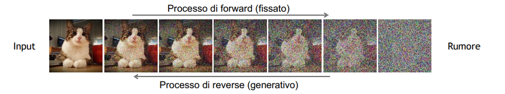
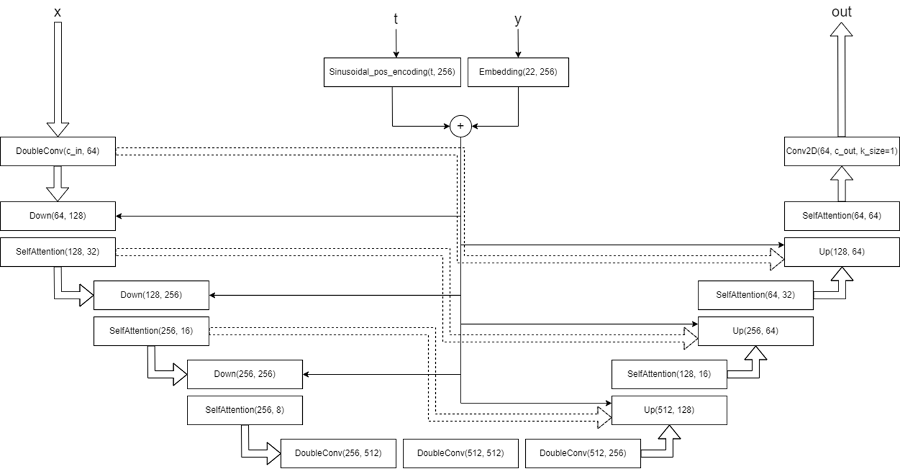
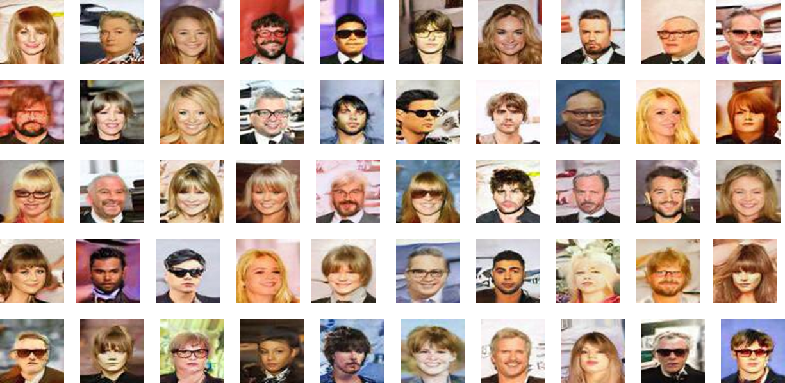
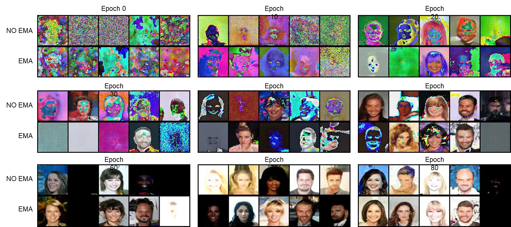
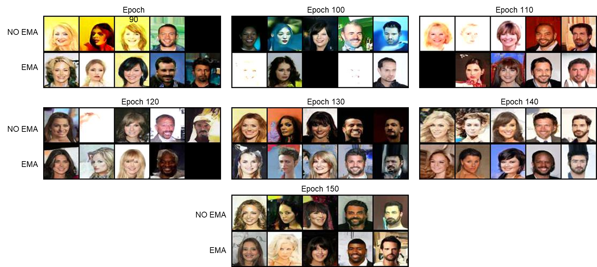

# Diffusion Models for Conditional Face Generation 🎨

[](https://www.python.org/downloads/)  [](https://pytorch.org/)

## 🚀 Overview

This repository contains the project for the **Computer Vision** exam of the Master's degree in Computer Engineering at the **University of Calabria**, completed in **June 2023**. 
For a detailed explanation of the project, refer to the **project outline** and **presentation** in the `docs/` folder.

---

## 🎯 Project Objective

The goal of this project is to build and train a **conditional diffusion model** for generating face images with specific attributes, such as glasses, smile, or fringe. The generated images aim to "fool" a pre-trained discriminator, achieving a high realism score.

This project explores the use of **diffusion models** for conditional image generation. It focuses on generating face images conditioned on specific attributes defined by binary labels (e.g., wearing glasses, smiling).  

The repository includes:  
- Implementation of a **Conditional Diffusion Model**.  
- Tools for training and testing the model.  
- Scripts to generate 500 output images based on test labels provided in `test.txt`.  

---

## 🗂️ Repository Structure

- **`classify/`**: Contains the script python `classify.py` for evaluating the generated images. Note: The pre-trained model for classify (`model_0605.pth`) is not included due to its size, so please contact me if you wish to replicate the results.
- **`dataset/`**: Contains the training data for the model (face images), along with the corresponding label file.
- **`docs/`**: Contains the project report and PowerPoint presentation.
- **`models/`**: This folder stores the model's parameter checkpoints, allowing you to resume training later. Note: The pre-trained model is not included due to its size, so please contact me if you wish to replicate the results.
- **`results/`**: Stores the results of the images generated during the training and testing process.
- **`output/`**: Contains the 500 final images generated during testing, which will be evaluated.
- **`main.py`**: The main script that can be run to start both training and testing.
- **`PROGETTO.ipynb`**: Notebook that runs the entire training and testing process, redundant, included for convenience.
- **`TEST.ipynb`**: Separate notebook for testing the generated images, redundant, included for convenience.
- **`settings.py`**: Configuration file containing parameters for training, testing, and file paths.
- **`models.py`**: Defines the generative model based on diffusion.
- **`ddpm.py`**: Contains the implementation of the diffusion model.
- **`utils.py`**: Contains utility methods.
- **`train.py`**: Implements the model's training method.
- **`test.txt`**: Contains the 50 image labels to generate for model evaluation.
- **`num_epoch.txt`**: Contains the number of epochs the model has been trained for; in case of training, it starts from this number.
- **`legenda_classi.json`**: Contains the mapping of binary format to integer class labels.
- **`requirements.txt`**: Lists the Python dependencies required to run the project.

---

## 🛠️ Installation

1. Clone the repository:  
   ```bash
   git clone https://github.com/fulvio9999/diffusion_models_face.git
   cd diffusion_models_face
   ```
2. Create the virtual environment via conda
    ```bash
    conda create -n diffusion_model python=3.7
    ```
3. Activate the virtual environment
    ```bash
    conda activate diffusion_model
    ```
3. Install the dependencies
   ```bash
   conda install -c intel mkl_fft
   pip install --user --requirement requirements.txt
   ```

---

## 🏋️‍♂️ Training 

To start or continue the training phase, run the following command:

```bash
python main.py -train
```

* The training process will continue from the last epoch (as specified in `settings.NUM_EPOCH_FILE`) and from the last checkpoint, if available (located in the folder `settings.MODEL_PATH`, with the filename `settings.MODEL_FILE` or `settings.EMA_MODEL_FILE`).
* The trained model will be saved at the end of each epoch to update the checkpoint. The epoch number will also be updated in `settings.NUM_EPOCH_FILE`.
* Every 10 epochs, 12 images will be saved to `settings.RESULTS_PATH` for both the model with and without EMA.
* Training will be performed on the images in the directory specified by `settings.DATASET_PATH`. The training file is located in this folder and is named `settings.TRAIN_FILE`.

---

## 🖌️ Generation

To generate 500 images from the trained model, run the following command:

```bash
python main.py -test [path_output]
```

* `[path_output]` is the path where the 500 generated images will be saved. This argument is optional; if omitted, the default path `settings.OUTPUT_PATH` will be used.
* The test file must be located at the path specified by `settings.TEST_FILE`. This file contains the labels used for generating the faces.

---

## 🔬 Testing

To evaluate the generated images, you can use the provided script `classify.py`. This script classifies the images and provides a score based on how well they resemble real images according to a pre-trained model.

#### Steps to Evaluate:
1. Ensure that you have generated the images using the testing procedure described earlier (`python main.py -test [path_output]`).
2. Navigate to the directory where the images are saved.
3. Run the following command to evaluate the generated images:

   ```bash
   python classify.py path/to/image/folder
   ```

Replace `path/to/image/folder` with the actual path to the folder containing the generated images.

### Important Note:
The classify.py script requires a pre-trained classifier model (`model_0605.pth`) to evaluate the generated images. Due to space limitations, the pre-trained model is not included in the repository. If you wish to replicate the evaluation process, please contact me to obtain the pre-trained classifier model.

---

## 🖼️ Screenshots and Results

Here are some screenshots showcasing the performance and results of the GANomaly models:

### 🌀 Diffusion Model Process:
<p align="center">
    
</p>

### 🧠 Model Architecture:
<p align="center">
    
</p>

### 🏆 Results:

In the competition, our model achieved **first place** with a score of **0.8**.

#### Training Setup
- **Hardware**: Colab PRO with Nvidia Tesla T4
- **Training Time**: 20 minutes per epoch
- **Number of Epochs**: 150
- **Batch Size**: 8
- **Dataset Size**: 30k images (combination of three datasets)

#### Hyperparameters
- **SEED**: 42
- **Learning Rate (LR)**: 0.001
- **Noise Steps**: 1000
- **Scheduler**: 'linear'
- **Loss Function**: 'mse' (Mean Squared Error)
- **Beta Start**: 1e-4
- **Beta End**: 0.02
- **Number of Classes (NUM_CLASSES)**: 22
- **EMA Beta**: 0.995

#### 👤 Some Generated Human Faces:
<p align="center">
    
</p>

#### 👤⏳ Generated Human Faces During Training:
<p align="center">
    
    
</p>

---

## 🧑‍🤝‍🧑 Collaboration

This project was developed in collaboration with [Vialt6](https://github.com/Vialt6). Thank you for the support and teamwork! 🙌

---
